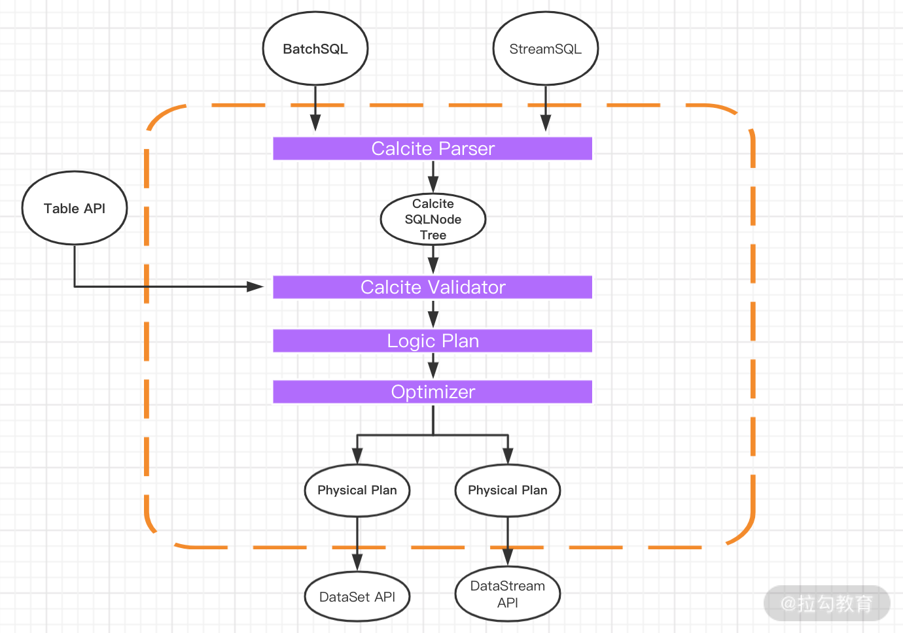
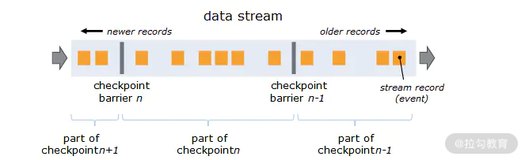

### 面试模块

1. Flink 面试基础篇，包含了 Flink 的整体介绍、核心概念、算子等考察点；
2. Flink 面试进阶篇，包含了 Flink 中的数据传输、容错机制、序列化、数据热点、反压等实际生产环境中遇到的问题等考察点；
3. Flink 面试源码篇，包含了 Flink 的核心代码实现、Job 提交流程、数据交换、分布式快照机制、Flink SQL 的原理等考察点；
4. Flink 面试方案设计篇，主要是生产环境中常见业务场景下的解决方案设计。

参考；
[全网第一份 | Flink 学习面试灵魂40问，看看你能答上来几个](https://mp.weixin.qq.com/s/-J-UZ6vs8BD9sYjdeMOmTQ)
[Flink 面试通关手册](https://mp.weixin.qq.com/s/xRqrojjFITuhswtjNJo7OQ)

##### 面试题 1：请介绍一下 Flink。
 ```
  这道题是一道很简单的入门题，考察我们队 Flink 整体的掌握情况，我们应该从以下几个基本的概念入手。
  
  Flink 是大数据领域的分布式实时和离线计算引擎，其程序的基础构建模块是流（Streams）和转换（Transformations），每一个数据流起始于一个或多个 Source，并终止于一个或多个 Sink。数据流类似于有向无环图（DAG）。
  
  Flink 提供了诸多高抽象层的 API 以便用户编写分布式任务：
  
  DataSet API，对静态数据进行批处理操作，将静态数据抽象成分布式的数据集，用户可以方便地使用 Flink 提供的各种操作符对分布式数据集进行处理，支持 Java、Scala 和 Python；
  
  DataStream API，对数据流进行流处理操作，将流式的数据抽象成分布式的数据流，用户可以方便地对分布式数据流进行各种操作，支持 Java 和 Scala；
  
  Table API，对结构化数据进行查询操作，将结构化数据抽象成关系表，并通过类 SQL 的 DSL 对关系表进行各种查询操作，支持 Java 和 Scala。
  
  此外，Flink 还针对特定的应用领域提供了领域库，例如，Flink ML，Flink 的机器学习库提供了机器学习 Pipelines API 并实现了多种机器学习算法；Gelly、Flink 的图计算库提供了图计算的相关 API 及多种图计算算法的实现。
```


##### 面试题 2：Flink 和 Spark Streaming 的异同点有哪些？

> 分析：这是一个非常宏观的面试题，因为两个框架的不同点非常之多。但是在面试时有非常重要的一点一定要回答出来：Flink 是标准的实时处理引擎，基于事件驱动；
>而 Spark Streaming 是微批（Micro-Batch）的模型。
  
>  在“03 | Flink 的编程模型与其他框架比较”课时中也讲过 Flink 的优势及与其他框架的区别。
  
>  *架构*  
> Spark Streaming 的架构是基于 Spark 的，它的本质是微批处理，每个 batch 都依赖 Driver，我们可以把 Spark Streaming 理解为时间维度上的 Spark DAG。
> Flink 也采用了经典的主从模式，DataFlow Graph 与 Storm 形成的拓扑 Topology 结构类似，Flink 程序启动后，会根据用户的代码处理成 Stream Graph，然后优化成为 JobGraph，JobManager 会根据 JobGraph 生成 ExecutionGraph。ExecutionGraph 才是 Flink 真正能执行的数据结构，当很多个 ExecutionGraph 分布在集群中，就会形成一张网状的拓扑结构。
> 
> 容错
> 
> 针对 Spark Streaming 任务，我们可以配置对应的 Checkpoint，也就是保存点。当任务出现 Failover 的时候，会从 Checkpoint 重新加载，使得数据不丢失。但是这个过程会导致原来的数据重复处理，不能做到“只处理一次”语义。
> 
> Flink 基于两阶段提交实现了精确的一次处理语义，我们在第 14 课时 “Flink Exactly-once 实现原理解析” 中有过详细的讲解。
> 
> 反压（BackPressure）
> 
> 反压是分布式处理系统中经常遇到的问题，当消费者速度低于生产者的速度时，则需要消费者将信息反馈给生产者使得生产者的速度能和消费者的速度进行匹配。
> 
> Spark Streaming 为了实现反压这个功能，在原来的架构基础上构造了一个“速率控制器”，“速率控制器”会根据几个属性，比如任务的结束时间、处理时长、处理消息的条数等计算一个速率。在实现控制数据的接收速率中用到了一个经典的算法，即“PID 算法”。
> 
> Flink 没有使用任何复杂的机制来解决反压问题，Flink 在数据传输过程中使用了分布式阻塞队列。我们知道在一个阻塞队列中，当队列满了以后发送者会被天然阻塞住，这种阻塞功能相当于给这个阻塞队列提供了反压的能力。
> 
> 时间机制
> 
> Spark Streaming 支持的时间机制有限，只支持处理时间。 Flink 支持了流处理程序在时间上的三个定义：处理时间、事件时间、注入时间；同时也支持 watermark 机制来处理滞后数据。
  


##### 面试题 3：：请谈谈 Flink 的组件栈和数据流模型？
> Flink 自身提供了不同级别的抽象来支持我们开发流式或者批量处理程序，上图描述了 Flink 支持的 4 种不同级别的抽象。
> 
> 对于我们开发者来说，大多数应用程序不需要上图中的最低级别的 Low-level 抽象，而是针对 Core API 编程，比如DataStream API（有界/无界流）和DataSet API（有界数据集）。这些流畅的 API 提供了用于数据处理的通用构建块，比如各种形式用户指定的转换、连接、聚合、窗口、状态等。
> 
> Table API 和 SQL是 Flink 提供的更为高级的 API 操作，Flink SQL 是 Flink 实时计算为简化计算模型，降低了用户使用实时计算门槛而设计的一套符合标准 SQL 语义的开发语言。

>Flink 程序的基本构建是数据输入来自一个 Source，Source 代表数据的输入端，经过 Transformation 进行转换，然后在一个或者多个 Sink 接收器中结束。数据流（Stream）就是一组永远不会停止的数据记录流，
而转换（Transformation）是将一个或多个流作为输入，并生成一个或多个输出流的操作。在执行时，Flink 程序映射到 Streaming Dataflows，由流（Streams）和转换操作（Transformation Operators）组成。


##### 面试题 4： 请谈谈 Flink 中的角色和作用各是什么？
> Flink 程序在运行时主要有 TaskManager、JobManager、Client 三种角色。其中 JobManager 扮演着集群中的管理者 Master 的角色，它是整个集群的协调者，负责接收 Flink Job、协调检查点、Failover 故障恢复等，同时管理 Flink 集群中从节点 TaskManager。
> 
> TaskManager 是实际负责执行计算的 Worker，在其上执行 Flink Job 的一组 Task，每个 TaskManager 负责管理其所在节点上的资源信息，比如内存、磁盘、网络，在启动的时候将资源的状态向 JobManager 汇报。
> 
> Client 是 Flink 程序提交的客户端，当用户提交一个 Flink 程序时，会先创建一个 Client，该 Client 首先会对用户提交的 Flink 程序进行预处理，然后提交到 Flink 集群中处理，所以 Client 需要从用户提交的 Flink 程序配置中获取 JobManager 的地址，并建立到 JobManager 的连接，将 Flink Job 提交给 JobManager。

##### 面试题 5： 请谈谈 Flink 中的计算资源 Task Slot？
> Flink 中的计算资源是非常容易被忽略的一个知识点，它直接关系着我们线上 Flink 任务调优的原理和过程，变相的考察我们对于大数量下的 Flink 资源分配和调优是否熟悉。
> 
> 在 Flink 集群中，一个 TaskManger 就是一个 JVM 进程，并且会用独立的线程来执行 Task，为了控制一个 TaskManger 能接受多少个 Task，Flink 提出了 Task Slot 的概念。
> 
> 我们可以简单地把 Task Slot 理解为 TaskManager 的计算资源子集。假如一个 TaskManager 拥有 5 个 Slot，那么该 TaskManager 的计算资源会被平均分为 5 份，不同的 Task 在不同的 Slot 中执行，避免资源竞争。但需要注意的是，Slot 仅仅用来做内存的隔离，对 CPU 不起作用。那么运行在同一个 JVM 的 Task 可以共享 TCP 连接，以减少网络传输，在一定程度上提高了程序的运行效率，降低了资源消耗。


##### 面试题 6：请谈谈 Flink 中的水印。
> Flink 中的水印是难度较高的一个知识点，这个问题考察开发者在实际生产中如何处理乱序问题的，是基于什么样的考虑选择不同的水印生成方式。
> 
> 水印的出现是为了解决实时计算中的数据乱序问题，它的本质是 DataStream 中一个带有时间戳的元素。如果 Flink 系统中出现了一个 WaterMark T，那么就意味着 EventTime < T 的数据都已经到达，窗口的结束时间和 T 相同的那个窗口被触发进行计算了。
> 
> 也就是说：水印是 Flink 判断迟到数据的标准，同时也是窗口触发的标记。
> 
> Flink 中的水印有两种：
> 
> 周期生成水印 AssignerWithPeriodicWatermarks，周期默认的时间是 200ms；
> 
> 按需要生成水印 PunctuatedWatermark，它适用于根据接收到的消息判断是否需要产生水印。


##### 面试题 7：请谈谈 Flink 中的窗口。
> 这道题考察的是开发者在不同的业务场景中是如何选择时间窗口的，当然变相的就会和你的业务关联，为什么这样选择窗口？他有什么特点？
> 
> 根据窗口数据划分的不同，目前 Flink 支持如下 3 种：
> 
> 滚动窗口，窗口数据有固定的大小，窗口中的数据不会叠加；
> 
> 滑动窗口，窗口数据有固定的大小，并且有生成间隔；
> 
> 会话窗口，窗口数据没有固定的大小，根据用户传入的参数进行划分，窗口数据无叠加。


##### 面试题 8：请谈谈你对 Flink Table & SQL 的了解情况？以及 TableEnvironment 这个类有什么样的作用？
> 这道题考察的是对 Flink Table & SQL 的掌握情况，要知道 Flink 中的 TableEnvironment 有 5 个之多，那么对于 TableEnvironment 的掌握就显得特别重要。
> 
> TableEnvironment 是 Table API 和 SQL 集成的核心概念，它主要被用来创建 Table & SQL 程序的上下文执行环境，这个类主要用来：
> 
> 在内部 catalog 中注册表
> 
> 注册外部 catalog
> 
> 执行 SQL 查询
> 
> 注册用户定义（标量、表或聚合）函数
> 
> 将 DataStream 或 DataSet 转换为表
> 
> 持有对 ExecutionEnvironment 或 StreamExecutionEnvironment 的引用


##### 面试题 9：Flink SQL 的原理是什么？请谈谈整个 SQL 的解析过程


> 用户使用对外提供的 Stream SQL 语法来开发业务应用；
> 
> 用 calcite 对 StreamSQL 进行语法检验，语法检验通过后，转换成 calcite 的逻辑树节点，最终形成 calcite 的逻辑计划；
> 
> 采用 Flink 自定义的优化规则和 calcite 火山模型、启发式模型共同对逻辑树进行优化，生成最优的 Flink 物理计划；
> 
> 对物理计划采用 janino codegen 生成代码，生成用低阶 API DataStream 描述的流应用，并提交到 Flink 平台执行。


##### 面试题 10：请谈谈你对 Flink 容错的理解
Flink 的容错机制是非常重要的一个特性，我们在回答这个问题时，要把 CheckPoint 和 State 都答出来，并且阐述一下原理。
Flink 实现容错主要靠强大的 CheckPoint 和 State 机制。Checkpoint 负责定时制作分布式快照、对程序中的状态进行备份；State 用来存储计算过程中的中间状态。
Flink 提供了三种可用的状态后端用于在不同情况下进行状态后端的保存：
- MemoryStateBackend
- FsStateBackend
- RocksDBStateBackend


##### 面试题 11 ：Flink 是如何保证 Exactly-once 语义的
这道题在面试时一定会遇到，Flink 的“精确一次”语义的支持是区别于其他框架最显著的特性之一。

Flink 通过实现两阶段提交和状态保存来实现端到端的一致性语义，分为以下几个步骤：

1. 开始事务（beginTransaction），创建一个临时文件夹，然后把数据写入这个文件夹里面；
2. 预提交（preCommit），将内存中缓存的数据写入文件并关闭；
3. 正式提交（Commit），将之前写完的临时文件放入目标目录下，这代表着最终的数据会有一些延迟；
4. 丢弃（Abort），丢弃临时文件。

我们在第 14 课时“Flink Exactly-once 实现原理解析”中还对 Flink 分布式快照的核心元素 Barrier 和两阶段提交的原理做过详细讲解，可以参考。


##### 面试题 12：请谈谈你遇到的数据倾斜问题？Flink 中的 Window 出现了数据倾斜，你有什么解决办法？
这道题也是面试中一定会被提及的问题，数据倾斜是大数据领域最常见的问题之一。Flink 中对于数据倾斜的调优极其重要，我们一定要掌握。

我们在第 16 课时“如何处理生产环境中的数据倾斜问题”中对于这个问题有过一整节的讲解。

**产生数据倾斜的原因主要有 2 个方面**：

- 业务上有严重的数据热点，比如滴滴打车的订单数据中北京、上海等几个城市的订单量远远超过其他地区；
- 技术上大量使用了 KeyBy、GroupBy 等操作，错误的使用了分组 Key，人为产生数据热点。

**因此解决问题的思路也很清晰：**

- 业务上要尽量避免热点 key 的设计，例如我们可以把北京、上海等热点城市分成不同的区域，并进行单独处理；
- 技术上出现热点时，要调整方案打散原来的 key，避免直接聚合；
- 此外 Flink 还提供了大量的功能可以避免数据倾斜。

另外我们还可以结合实际工作中出现的问题做举例说明。


##### 面试题 13：Flink 任务出现很高的延迟，你会如何入手解决类似问题？
这是一个实操性很强的问题，我们在回答这类问题一定要结合实际情况来说。在生产环境中处理这类问题会从以下方面入手：

- 在 Flink 的后台任务管理中，可以看到 Flink 的哪个算子和 task 出现了反压；

- 资源调优和算子调优，资源调优即对作业中的 Operator 并发数（Parallelism）、CPU（Core）、堆内存（Heap_memory）等参数进行调优；

- 作业参数调优，并行度的设置、State 的设置、Checkpoint 的设置。

##### 面试题 14： 请谈谈你们是如何处理脏数据的？
这也是一个开放性的面试题，建议你结合自己的实际业务来谈。比如可以通过一个 fliter 算子将不符合规则的数据过滤出去。
当然了，我们也可以在数据源头就将一些不合理的数据抛弃，不允许进入 Flink 系统参与计算。


##### 面试题 15：请谈谈 Operator Chain 这个概念？
算子链是我们进行任务调优一定会遇到的问题，主要考察我们对于概念是否正确理解，实际操作中有怎样的指导作用。

为了更高效地分布式执行，Flink 会尽可能地将 Operator 的 Subtask 链接（Chain）在一起形成 Task，每个 Task 在一个线程中执行。
将 Operators 链接成 Task 是非常有效的优化，它能减少：

- 线程之间的切换；
- 消息的序列化/反序列化；
- 数据在缓冲区的交换；
- 延迟的同时提高整体的吞吐量。

这就是我们所说的算子链。

##### 面试题 10：Flink 在什么情况下才会把 Operator Chain 在一起形成算子链？
这道题是有标准答案的，截止 1.11 版本，Flink 的算子之间形成算子链需要以下条件：

- 上下游的并行度一致
- 下游节点的入度为 1（即下游节点没有来自其他节点的输入）
- 上下游节点都在同一个 Slot Group 中
- 下游节点的 Chain 策略为 ALWAYS（可以与上下游链接，Map、Flatmap、Filter 等默认是 ALWAYS）
- 上游节点的 Chain 策略为 ALWAYS 或 HEAD（只能与下游链接，不能与上游链接，Source 默认是 HEAD）
- 两个节点间数据分区方式是 Forward
- 用户没有禁用 Chain


##### 面试题 11：请谈谈 Flink 中的分布式快照机制是如何实现的？
这道题也是考察我们对于 Flink 掌握深度的一个问题，需要你完全理解 Flink 中的分布式快照机制的实现原理。

Flink 容错机制的核心部分是制作分布式数据流和操作算子状态的一致性快照，这些快照充当一致性 Checkpoint，系统可以在发生故障时回滚。
Flink 用于制作这些快照的机制在“分布式数据流的轻量级异步快照”中进行了描述，它受到分布式快照的标准 Chandy-Lamport 算法的启发，专门针对 Flink 的执行模型而定制。



barrier 在数据流源处被注入并行数据流中。快照 n 的 barrier 被插入的位置（我们称为 Sn）是快照所包含的数据在数据源中最大位置。  

>例如，在 Apache Kafka 中，此位置将是分区中最后一条记录的偏移量，将该位置 Sn 报告给 Checkpoint 协调器（Flink 的 JobManager）。
接着 barrier 向下游流动。当一个中间操作算子从其所有输入流中收到快照 n 的 barrier 时，它会为快照 n 发出 barrier 进入其所有输出流中。    
一旦 sink 操作算子（流式 DAG 的末端）从其所有输入流接收到 barrier n，它就向 checkpoint 协调器确认快照 n 完成。在所有 sink 确认快照后，意味着快照已完成。
>一旦完成快照 n，job 将永远不再向数据源请求 Sn 之前的记录，因为此时这些记录（及其后续记录）将已经通过整个数据流拓扑，也即已经被处理结束。


